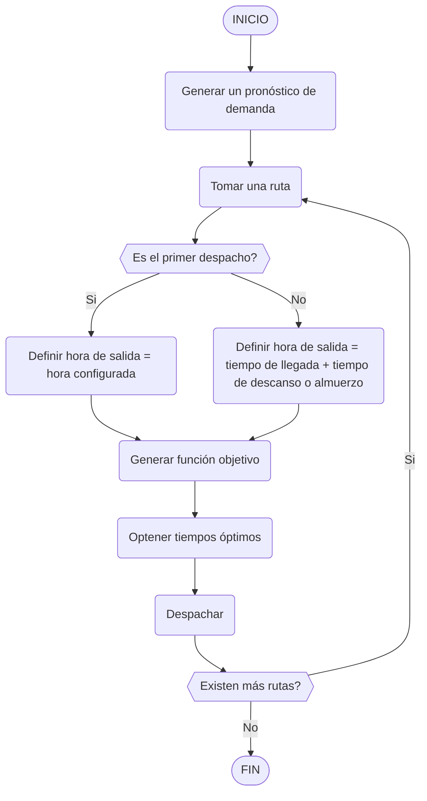

# Objetivos
- [ ] Crear un programa que permita optimizar los despachos de los buses urbanos.
- [ ] El programa podrá recalcular los despachos a cualquier hora del día.
- [ ] Contar con un pronóstico de demanda de transporte para determinar el mejor tiempo de despacho
- [ ] El programa tiene que ser conciente de cambios que existan en las rutas, tales como:
    - Cambios en las rutas por obras públicas o cierre de vías
    - Revisión de agentes de tránsito
    - etc
- [ ] Actualización dinámica de la tabla de despachos en base a la demanda prevista y cambios surgidos
- [ ] Generar una combinación óptima de unidad despachada, y tiempo de despacho


# Inputs
## Parametros
Para el algoritmo, se definen los límites con los que se debe trabajar, así como los recursos de los que se dispone. Se plantea un esquema en formato JSON para esta tarea. La especificación es la siguiente:

### Estructura del archivo
El archivo JSON se compone de los siguientes elementos:

- `paradas`: Lista de objetos `parada`.
- `rutas`: Lista de objetos `ruta`.
- `horario`: Objeto que define los horarios de trabajo.
- `penalizaciones`: Objeto que define las penalizaciones para diferentes variables.
- `buses`: Lista de objetos `bus`.

#### Descripción de los objetos

##### 1. Parada
- `id`: Identificador único de la parada (tipo `int` o `string`).
- `nombre`: Nombre de la parada (tipo `string`).
- `tiempo`: Tiempo normal de recorrido desde la parada anterior (tipo `timestamp`).
- `retrasoPorEvento`: Retraso adicional por eventos (tipo `timestamp`, por defecto 0).

##### 2. Ruta
- `id`: Identificador único de la ruta (tipo `int` o `string`).
- `paradas`: Lista ordenada de IDs de las paradas que conforman la ruta (tipo `int[]` o `string[]`).

##### 3. Horario
- `inicio`: Hora de inicio de la jornada laboral (objeto `limiteHorario`).
- `fin`: Hora de finalización de la jornada laboral (objeto `limiteHorario`).
- `descanso`: Hora de descanso dentro de la jornada laboral (objeto `limiteHorario`).
- `intervalo`: Intervalo de tiempo entre despachos (tipo `timestamp`).
- `almuerzo`: Objeto que define el tiempo de almuerzo de los conductores.

###### 3.1. LimiteHorario
- `min`: Hora mínima (tipo `time`).
- `max`: Hora máxima (tipo `time`).

###### 3.2. HorarioAlmuerzo
- `tiempo`: Duración del almuerzo (tipo `timestamp`).
- `inicio`: Hora mínima para el primer almuerzo (tipo `time`).
- `fin`: Hora máxima para el último almuerzo (tipo `time`).

##### 4. Penalizaciones
- `precioMinuto`: Penalización por minuto de viaje (tipo `float`).
- `costoCapacidad`: Penalización por diferencia entre capacidad máxima y demanda (tipo `float`).
- `costoPocosPasajeros`: Penalización por baja demanda de pasajeros (tipo `float`).
- `costoVacio`: Penalización por viaje sin demanda de pasajeros (tipo `float`).

##### 5. Bus
- `unidad`: Número de unidad del bus (tipo `int`).
- `min`: Capacidad mínima de pasajeros (tipo `int`).
- `max`: Capacidad máxima de pasajeros (tipo `int`).
- `salida`: ID de la parada de inicio del recorrido (tipo `string`, solo para despacho inicial).
- `disponible`: Indica si el bus está disponible (tipo `bool`).
- `ruta`: ID o número de la ruta que sigue el bus (tipo `int` o `string`).

### Ejemplo del formato
```json
{
    "paradas": [
        {
            "id": "c_ruivola",
            "nombre": "Calle Ruivola",
            "tiempo": "00:09:00",
            "retrasoPorEvento": "00:10:00"
        }
    ],
    "rutas": [
        {
            "id": 30,
            "paradas": [ 0, 1, 2, 3, 4, 5, 6, 7, 8, 9, 10, 11, 12, 13 ]
        }
    ],
    "horaInicio": {
        "max": "06:05:00",
        "min": "05:30:00"
    },
    "horaFin": {
        "max": "19:00:00",
        "min": "18:30:00"
    },
    "descanso": {
        "min": "00:03:00",
        "max": "00:15:00",
        "almuerzo": {
            "tiempo": "00:30:00",
            "inicio": "12:00:00",
            "fin": "14:00:00"
        }
    },
    "horario": {
        "inicio": {
            "max": "07:05:00",
            "min": "05:30:00"
        },
        "fin": {
            "max": "19:00:00",
            "min": "18:30:00"
        },
        "descanso": {
            "min": "00:05:00",
            "max": "00:20:00"
        },
        "intervalo": "00:05:00",
        "almuerzo": {
            "tiempo": "00:30:00",
            "inicio": "12:00:00",
            "fin": "14:00:00"
        },
    },
    "penalizaciones": {
        "precioMinuto": 1.0,
        "costoCapacidad": 1.0,
        "costoPocosPasajeros": 0.5,
        "costoVacio": 50
    },
    "buses": [
        {
            "unidad": 1,
            "min": 30,
            "max": 47,
            "disponible": true,
            "ruta": 30
        }
    ]
}
```

## Dataset
El dataset será utilizado para entrenar a un modelo de forecasting, y requeriría de las siguientes columnas:
- `FechaHora`, de tipo `datetime`, el intervalo está por definirse
- `IDParada`, de tipo `string`, el ID de una parada. Cuando una parada está repetida en varias rutas, se las trata como paradas distintas.
- `Pasajeros`, de tipo `int`, es la cantidad de pasajeros que se subieron a una unidad desde la parada a la hora y fecha indicada.

Adicional, se requiere de un dataset de días festivos y un dataset personalizado para una mayor precisión. Para una interpretación adecuada de los datos por el algoritmo posterior al modelo, el campo `IDParada` debe ser el mismo que el de las paradas proveídas a los parámetros del algoritmo

## Otros inputs considerados
- Pronóstico de pasajeros esperando en una parada
- Tiempo estimado de espera por pasajero (tiempo de bus en la parada)
- Precio del minuto


# Algoritmo
Se utilizará una combinación de un algoritmo de inteligencia artificial, enfocado principalmente en el pronóstico de demanda, los resultados de este serán utilizados en un algoritmo de optimización basado en grafos, el cual va a calcular las combinaciones óptimas.

<!-- 
```text
forecast = generacion_forecast()
por cada unidad:
    si es el primer despacho:
        hora_salida = hora configurada
    sino:
        hora_salida = tiempo_llegada + tiempo descanso o almuerzo
    fin

    hasta despachar:
        pronostico = forecast(hora_salida)
        peso_demanda = calculo_peso(pronostico)
        si peson_demanda es mayor a maximo_tolerable:
            despachar()
        sino:
            hora_salida += intervalo
        fin
    fin
fin
```
-->

> [!IMPORTANT]  
> El pronóstico generado por la IA no tiene por qué ser granular, se puede puede calcular la proyección para tener un estimado a niveles más granulares

> [!IMPORTANT]  
> Se utilizará el modelo _Prophet_, un modelo Open Source desarrollado por Meta para realizar los pronósticos. Este modelo puede contemplar datasets de terceros como días festivos


# Proceso
A la falta de un dataset con datos reales, se genera uno con patrones preestablecidos, asumiendo que existirán patrones cuando se lleve al entorno de producción, ejemplos de estos _"patrones"_ son horarios, días festivos y días de la semana.  
Para la generación del dataset se realiza el siguiente procedimiento:
1. Se toma la función de la onda sinusoidal como patrón para el cálculo de pasajeros por hora.
2. Se asigna multiplicadores a cada hora del horario laboral del transporte público, basándose en cómo este está reflejado en casos de la vida real, un ejemplo de este es considerar horas de inicio y fin de jornada, y horas de almuerzo como horas de mayor fluctuación de pasajeros.
3. Se asigna valores a cáda día de la semana, de tal modo que se considera días como fines de semana como días de menor fluctuación.
4. Una vez obtenido estos valores, se los proyecta para obtener un dataset con datos tomados cada 5 minutos por 3 meses

## Algoritmos probados para el pronóstico
### AWS Forecast
Un servicio de Amazon AWS, brinda modelos avanzados de forecasting.
#### Pros
- Fácil de usar y configurar
- Alta presición con AutoML
- Soporta clima, días festivos e ids
#### Contras
- Poca flexibilidad
- Costo de tiempo y dinero en el entrenamiento

### LSTM
Un modelo de Machine Learning que puede ser ejecutado localmente. Este modelo analiza y replica patrones.
#### Pros
- Menor costo a realizar pruebas
- Más flexibilidad e integración con otros frameworks
#### Contras
- No soporta ids, se debería correr el modelo por cada parada

### MLForecast y NeuralForecast
Librerías de Nixtla, que proveen de utilidades y funciones para entrenar modelos de IA.
#### Pros
- Corre localmente
- Soporta ids
- Integración con Apache spark y productos similares
#### Contras
- El peso de instalación de dicha librería es grande
- Sólo permite intervalos de fecha fijos, no contempla horarios
- Uso de recursos

### Prophet
Una librería de Meta, así como las anteriores, esta busca ser intuitiva de usar.
#### Pros
- Corre localmente
- Permite la inclusión de un calendario, así como temporadas personalizadas e intervalos de tiempo personalizados
#### Contras
- No soporta ids
- Oficialmente descontinuada, sólo se enfocan en dar soporte

# Output

# Discusión y trabajo futuro
Los algoritmos planteados no han sido probados con información _"real"_, los datos utilizados para las pruebas de estos modelos son generadas mediante scripts, o se utilizó información que comparte características similares. Razón por la cual es importante pasar estos algoritmos por un proceso iterativo de prueba y refinamiento hasta poder tener márgenes aceptados con datos más cercanos a los que se tendrá en producción.
